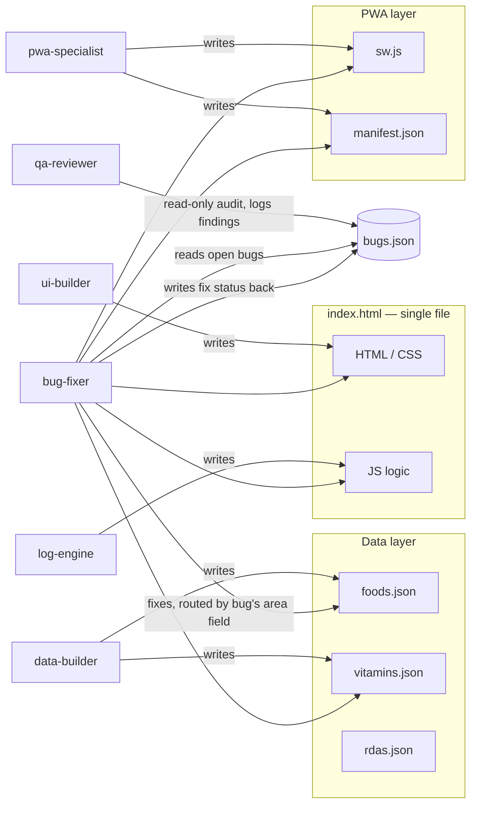
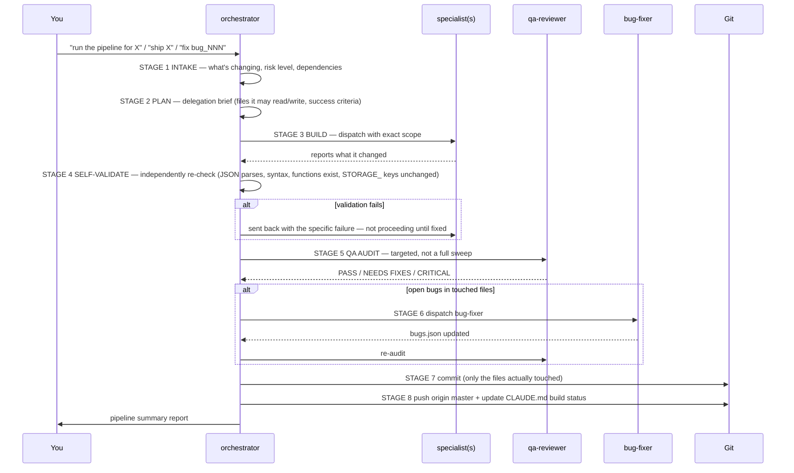

# Agent Cheat Sheet — Nutrient Tracker PWA

Quick reference for routing work to the right specialist in `.claude/agents/`.
See individual `.md` files in this folder for full personas.

## The seven agents

| Agent | Owns (writes) | Reads only | Tools | Model | Type |
|---|---|---|---|---|---|
| `data-builder` | `foods.json`, `vitamins.json` | — | Read, Write, Edit, Bash | haiku | specialist |
| `ui-builder` | `index.html` markup/CSS | — | Read, Write, Edit | sonnet | specialist |
| `log-engine` | `index.html` JS logic | — | Read, Write, Edit | sonnet | specialist |
| `pwa-specialist` | `sw.js`, `manifest.json` | `index.html`, `CLAUDE.md` | Read, Write, Edit, Bash | sonnet | specialist |
| `qa-reviewer` | `bugs.json` (findings only) | everything | Read, Grep, Glob, Bash | haiku | specialist (read-only on app code) |
| `bug-fixer` | whatever file a bug touches, + `bugs.json` status | `CLAUDE.md` | Read, Write, Edit, Bash | sonnet | specialist |
| `orchestrator` | nothing directly — delegates all app-code edits | everything | Read, Write, Edit, Bash | sonnet | coordinator |

## Diagram 1 — who owns which file

`rdas.json` currently has no dedicated owner — treat it as `data-builder`'s territory even though its `.md` file doesn't name it explicitly (worth fixing, see Recommendations below).

## Diagram 2 — the orchestrator pipeline

Use this whenever a change is actually shipping (vs. a one-off question or draft).

Full stage-by-stage rules live in `orchestrator.md` — this is the shape of it, not a replacement.

## How you should be calling things

**Default to the orchestrator** for anything that's actually shipping:
- New feature, bug fix, data addition, UI change, PWA/offline change
- "Fix bug_NNN" / "work through the backlog"
- Anything you'd otherwise remember to `git commit && git push` yourself afterward

Say: *"run the pipeline for [X]"*, *"ship [X]"*, *"fix bug_011"*, or just describe the change — the orchestrator's job is to figure out which specialist(s) it needs, validate their work independently (it does not trust the specialist's own report), run a targeted QA pass, and only push once everything's clean.

**Call a specialist directly, skipping the orchestrator, only when:**
- You want a quick draft/exploration and do **not** want it committed or pushed yet (e.g. "have ui-builder sketch a weekly chart layout, don't commit")
- You want a read-only answer with no code change — `qa-reviewer` alone, "audit X, don't write anything"
- The change is trivially scoped to one file and you're going to review + commit it yourself right after

**Never:**
- Run two specialists in parallel if both would write `index.html` (real lost-write risk — sequential only, or have one return a diff for you to merge)
- Ask `bug-fixer` to batch unrelated bugs into one edit pass — even same-file, it re-reads between each fix
- Skip the self-validate / QA step on anything CRITICAL risk (localStorage key renames, `init()`, `addLogEntry()`, `getUserRDA()`, `getMicronutrientStatus()`, `exportAllDataAsJSON()`) — orchestrator is required to pause and confirm with you here, not just proceed

## Coordination rules

**Safe to run in parallel:**
- Any two agents writing *different* files (e.g. `log-engine` on `index.html` logic + `pwa-specialist` on `sw.js`)
- `qa-reviewer` alongside anything — it's read-only on app code
- Two `data-builder` runs on different files, or the same file with non-overlapping id ranges

**Must run sequentially:**
- Two agents that would both write `index.html` at once
- UI work that depends on new data-layer functions — run `log-engine` first, get its exact function names/shapes, then brief `ui-builder` with that contract
- `bug-fixer` fixing two bugs in the same file — separate read between each, even back-to-back

## Known environment limitation (confirmed, not just suspected)

Custom `subagent_type` values (`"orchestrator"`, `"qa-reviewer"`, `"bug-fixer"`, etc.) do **not** resolve in this environment — only the fixed built-ins (`general-purpose`, `Explore`, `Plan`, `claude`, `claude-code-guide`, `statusline-setup`) are available, even though these `.md` files exist correctly on disk. This has now been re-confirmed across multiple sessions, so treat it as a standing constraint, not something to keep retesting.

**Workaround, two flavors:**
1. **Orchestrator work** — the main session (me) has the same tool access the orchestrator persona needs (Read/Write/Edit/Bash/Agent), so I just run the pipeline stages directly myself rather than spawning a sub-agent for it.
2. **Specialist work** (data-builder, ui-builder, log-engine, pwa-specialist, qa-reviewer, bug-fixer) — dispatched as `general-purpose` with that agent's full persona pasted into the prompt.

One real cost of the workaround worth knowing: `general-purpose` doesn't automatically pick up a persona's declared `model:` (e.g. `qa-reviewer`'s `haiku`, `bug-fixer`'s `sonnet`) — it runs at whatever the caller's default/override is. Every `qa-reviewer` and `bug-fixer` run this session went out as `general-purpose` with no explicit model override, which in practice means they ran on a stronger model than the frontmatter specifies, not a weaker one. Not a bug exactly (see Recommendation 1 below), but worth knowing the frontmatter `model:` field is currently aspirational, not enforced, under this workaround.

## Real examples from this project

- **data-builder:** "Add these 9 Kirkland protein/fat items to foods.json, following the existing schema — flag anything you can't verify against a real label."
- **ui-builder:** "Add a Supplements section: nav item, category-grouped list, log modal. Here's the exact log-engine contract to build against: `loadVitamins()`, `logSupplement(id, dose, unit)`, `getDailyGoalProgress()` → [...]."
- **log-engine:** "Add `exportAllDataAsJSON()` and `getWeeklyMacroSummary()` to index.html — reuse `todayKey()`/`computeTotals()`, never round-trip a date string through `new Date()`."
- **pwa-specialist:** "Add vitamins.json to the service worker precache list and bump the cache version so installed devices pick it up."
- **qa-reviewer:** "Audit foods.json, vitamins.json, index.html, sw.js. Report CRITICAL / WARNING / SUGGESTION, read-only." — this is how bug_011/bug_012 (stat tiles missing touch target + keyboard access) were caught on 2026-08-13.
- **bug-fixer:** "Fix bug_011 and bug_012" — both landed in the same `.stat[data-key]` code; fixed sequentially with a re-read between edits, then self-validated independently (JSON parse, script-block syntax check, grep for `STORAGE_` constants) before it was trusted.
- **orchestrator:** "run the orchestrator" with two open warning bugs in the backlog — ran full INTAKE → PLAN → BUILD (bug-fixer) → SELF-VALIDATE → QA AUDIT (qa-reviewer, targeted) → BUG CHECK → COMMIT → PUSH → CLAUDE.md update, two commits (`822cf18`, `ed98eff`), zero open bugs left.

## Recommendations

**1. Bump `qa-reviewer`'s declared model from `haiku` to `sonnet`.**
The app is now 3500+ lines with layered, non-mechanical logic (micronutrient UL scoping by source, supplement unit-conversion factors, sparse-field conventions). A full-file audit needs to hold a lot of cross-references in mind at once — this session's audit (39 tool calls, full-file read) caught two real, non-obvious bugs, but `haiku` is the weaker model for that kind of sustained cross-file consistency checking. This also just formalizes what's already happening in practice under the subagent-type workaround above.

**2. Add an explicit keyboard/screen-reader line item to `qa-reviewer`'s Mobile UI checklist.**
Current wording only asks "Any hover-only interactions that break on touch screens?" — that's necessary but not sufficient. bug_012 (new click handler on a plain `
`, no `role`/`tabindex`/keyboard path) slipped through the *first* audit of that feature precisely because it's not a hover-only interaction, it's a touch-and-mouse-only one. Suggested addition: *"Any click handler attached to a non-`<button>`/non-`<a>` element without `role`, `tabindex`, and keyboard activation (or converted to a real interactive element)?"*

**3. Give `data-builder` explicit ownership of `rdas.json`.**
It's a data file with the same flat-schema conventions as `foods.json`/`vitamins.json`, but `data-builder.md` only names the other two. Currently orchestrator and ad-hoc sessions edit it without a named owner — worth a one-line addition to the persona file.

**4. Add a short pointer to the subagent-type limitation inside `orchestrator.md`, `qa-reviewer.md`, and `bug-fixer.md` themselves**, not just here — so a fresh session reading the agent file directly (without this cheat sheet loaded) doesn't waste a round-trip rediscovering that custom `subagent_type` values don't resolve.

**Do we need additional agents? No — not at current scope.** The app is a single `index.html` plus three flat JSON files; seven well-scoped agents already cover data / markup / logic / offline / audit / fix / coordination cleanly. Two tasks that might look like they want a dedicated agent don't, on inspection:
- *Accessibility* — fold into `qa-reviewer`'s checklist (Recommendation 2) rather than spinning up a separate reviewer; splitting one checklist category into its own agent is overhead this project's size doesn't need.
- *OCR nutrition-label scanning* (pending feature in CLAUDE.md) — will split across `ui-builder` (capture UI, form pre-fill) and `log-engine` (parsing extracted values) the same way barcode scanning did, successfully, without a new agent.

Revisit this if the project ever splits out of the single-`index.html` + flat-JSON structure (a real build step, a second HTML file, a backend) — that's the point where a build/lint specialist or a second orchestrator lane would start earning its keep.

## Golden rule

Agents self-report success — this project has caught real bugs their own reports missed (the `status` field bug-fixer forgot to flip on the first pass this session, caught only because it re-verified its own work). Always verify yourself before shipping: read the actual file, run a syntax check, and for anything touching the UI, load it in a real browser and click through it.
